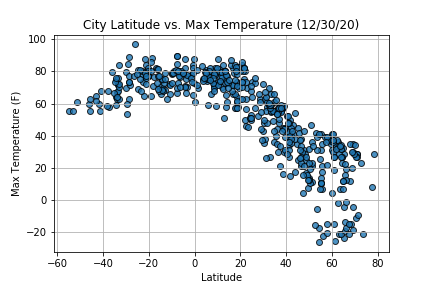
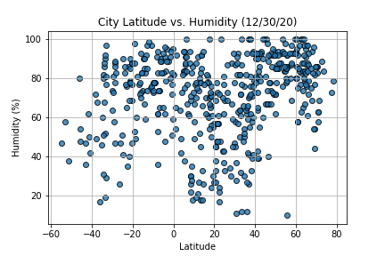
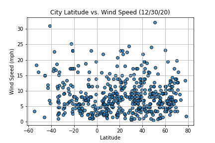
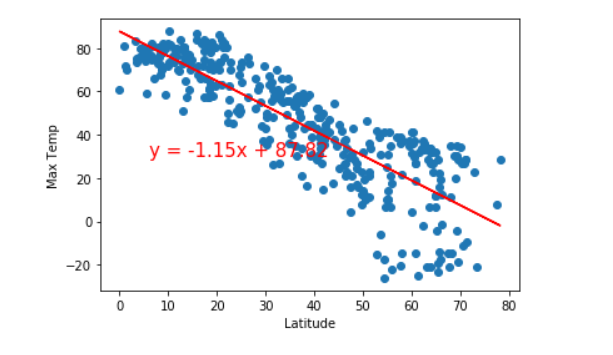
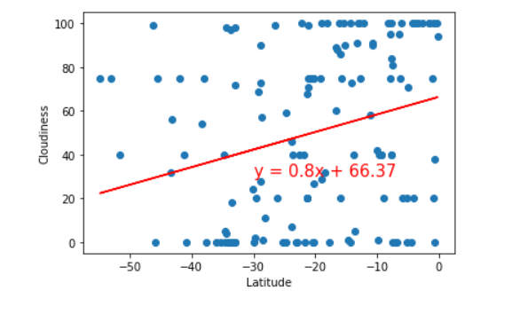

# APIs Weather & Citys

## Background 

Whether financial, political, or social -- data's true power lies in its ability to answer questions definitively. So using Python requests, APIs, and JSON traversals to answer a fundamental question: "What's the weather like as we approach the equator?"

Now, we know what you may be thinking: "Duh. It gets hotter..."

But, if pressed, how would you prove it?

Part I - Weather Py
Will be created a Python script to visualize the weather of 500+ cities across the world of varying distance from the equator. To accomplish this, will be used a simple Python library, the OpenWeatherMap API, and a little common sense to create a representative model of weather across world cities.

As a first requirement is to create a series of scatter plots to showcase the following relationships:

  - Temperature (F) vs. Latitude
  - Humidity (%) vs. Latitude
  - Cloudiness (%) vs. Latitude
  - Wind Speed (mph) vs. Latitude

  

As a second requirement is to run linear regression on each relationship, only this time separating them into Northern Hemisphere (greater than or equal to 0 degrees latitude) and Southern Hemisphere (less than 0 degrees latitude):

  - Northern Hemisphere - Temperature (F) vs. Latitude
  - Southern Hemisphere - Temperature (F) vs. Latitude
  - Northern Hemisphere - Humidity (%) vs. Latitude
  - Southern Hemisphere - Humidity (%) vs. Latitude
  - Northern Hemisphere - Cloudiness (%) vs. Latitude
  - Southern Hemisphere - Cloudiness (%) vs. Latitude
  - Northern Hemisphere - Wind Speed (mph) vs. Latitude
  - Southern Hemisphere - Wind Speed (mph) vs. Latitude

 

Part II - City Py 

Now let's go to work with weather data to plan future vacations. Using jupyter-gmaps and the Google Places API for this part of the assignment.

  - Create a heat map that displays the humidity for every city from the part I of the assigment.

